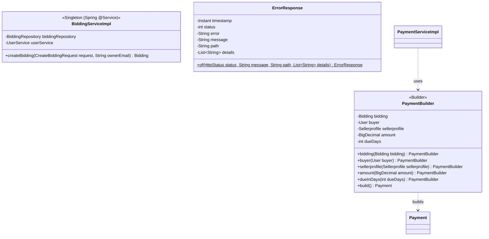
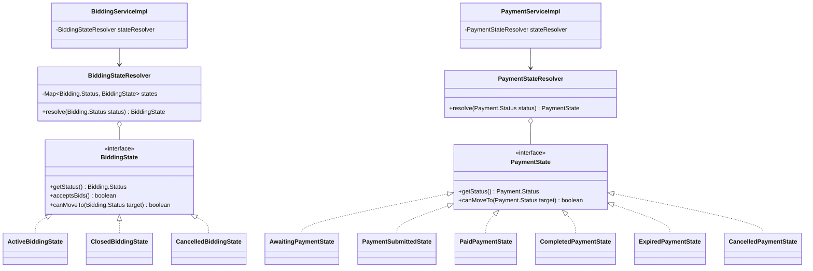

# Design Patterns

## Enterprise / Architectural Patterns
| Pattern | ปัญหาที่แก้ / การใช้งาน | ไฟล์/คลาสที่ใช้ |
|---|---|---|
| Layered Architecture | จัดระเบียบโครงสร้างโปรเจกต์ให้แยกส่วนการทำงานชัดเจน (Presentation, Business, Data Access) | โครงสร้างแพ็กเกจทั้งโปรเจกต์ (`controller` ➔ `service` ➔ `repository` ➔ `model`) |
| MVC | แยกส่วนรับ Request (Controller), การประมวลผลข้อมูล (Model), และการแสดงผล (View/JSON) | ทุกคลาสใน `controller/api/` (Controller), Entity/DTO (Model), และ JSON Response (View) |
| Repository Pattern | ซ่อนความซับซ้อนของการเขียน SQL และเชื่อมต่อฐานข้อมูลโดยตรง ทำให้เปลี่ยน Data Source ได้ง่าย | ทุกอินเทอร์เฟซในโฟลเดอร์ `repository/` ที่สืบทอด `JpaRepository` |
| Service Layer Pattern | รวม Business Logic ไว้ในที่เดียว เพื่อให้แยกออกจาก Controller ทำให้โค้ดสามารถใช้ซ้ำได้และทดสอบง่ายขึ้น | ทุกคลาสใน `service/` (Interface) และ `service/implementation/` (Concrete) |
| DTO Pattern + Mapper | ป้องกันการส่ง Entity ของฐานข้อมูลออกไปที่ API โดยตรง และแยก API Contract ออกจาก Database Schema | คลาสต่างๆ ใน `dto/request/`, `dto/response/` และคลาสสำหรับการแปลงใน `mapper/` |
| Dependency Injection | ลดความเชื่อมโยง (Coupling) ระหว่างคลาส เพื่อให้สามารถสลับหรือจำลอง (Mock) คลาสได้ง่ายเวลาเขียนเทสต์ | การใช้งาน Constructor Injection ในคลาสระดับ Controller และ Service (เช่น `BiddingServiceImpl.java`) |

## GoF Patterns (กลุ่ม Creational — 3 แบบ)

| Pattern | ปัญหาที่แก้ | ไฟล์/คลาสที่ใช้ |
|---|---|---|
| **Singleton** | ควบคุมให้มีออบเจกต์ (Instance) ของคลาสเพียงตัวเดียวตลอดอายุการทำงานของระบบเพื่อประหยัดหน่วยความจำ (ทำงานผ่าน Spring IoC Container) | คลาสที่ถูกกำกับด้วย `@Service`, `@RestController` เช่น `service/implementation/BiddingServiceImpl.java` |
| **Factory Method** | ควบคุมและจัดมาตรฐานการสร้างออบเจกต์ที่มีความซับซ้อนให้อยู่ที่จุดเดียว ทำให้ไม่ต้องเรียกใช้ Constructor โดยตรงในหลายๆ คลาสเมื่อต้องโยน Error | `exception/ErrorResponse.java` (มีการใช้ static factory method `ErrorResponse.of(...)` ในการสร้างออบเจกต์) |
| **Builder** (เขียนเอง) | การสร้าง `Payment` ต้องใช้หลายค่า (bidding, buyer, seller, amount) และต้องคำนวณ `createdAt`/`dueDate` เอง การเรียก setter ทีละตัวใน Service ทำให้โค้ดยาวและลืมตั้งค่าได้ จึงรวมขั้นตอนไว้ใน Builder และตรวจความครบถ้วนใน `build()` | Builder: `model/PaymentBuilder.java` ผู้ใช้งาน: `PaymentServiceImpl` (เมธอดสร้าง Payment หลัง bidding ปิด: `new PaymentBuilder().bidding(...).buyer(...).sellerprofile(...).amount(...).dueInDays(...).build()`) |

## Class Diagram ประกอบ (GoF Creational Patterns)

## Pattern ในส่วน Service Layer (Behavioral — State)

| Pattern | ปัญหาที่แก้ | ไฟล์/คลาสที่ใช้ |
|---|---|---|
| **State** | การเปลี่ยนสถานะของ Bidding (ACTIVE/CLOSED/CANCELLED) และ Payment (AWAITING_PAYMENT ➔ PAYMENT_SUBMITTED ➔ PAID ➔ COMPLETED / EXPIRED / CANCELLED) มีกฎต่างกันในแต่ละสถานะ (เช่น รับ bid ได้หรือไม่, ย้ายไปสถานะไหนได้) การใช้ if-else กระจายใน Service จะซ้ำซ้อนและแก้ยาก จึงแยกกฎของแต่ละสถานะเป็นคลาสของตัวเอง | Interface: `service/state/BiddingState.java`, `service/state/PaymentState.java` Concrete: `ActiveBiddingState`, `ClosedBiddingState`, `CancelledBiddingState`, `AwaitingPaymentState`, `PaymentSubmittedState`, `PaidPaymentState`, `CompletedPaymentState`, `ExpiredPaymentState`, `CancelledPaymentState` ตัวเลือกสถานะ: `BiddingStateResolver`, `PaymentStateResolver` ผู้ใช้งาน (Context): `BiddingServiceImpl` (บรรทัด 160, 177, 223), `AdminBiddingServiceImpl` (51), `AdminBidActionServiceImpl` (77), `PaymentServiceImpl` (207), `AdminPaymentServiceImpl` (68) |

> หมายเหตุ: หมวด GoF ที่เลือกใช้ต้องเป็นกลุ่มเดียวและมีอย่างน้อย 3 แบบ ในโค้ดนี้พบ Behavioral ชัดเจนเพียง State เท่านั้น (ไม่พบ Observer/Strategy/Template Method) จึงควรตัดสินใจว่าจะส่งกลุ่ม Creational (3 แบบด้านบน) หรือไม่
