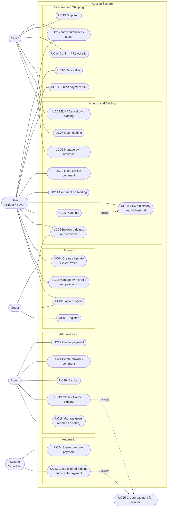

# 1. Use Case Diagram + Use Case Description

## 1.1 Actors

| Actor | คำอธิบาย | ที่มาในโค้ด |
|---|---|---|
| Guest | ผู้ใช้ที่ยังไม่ล็อกอิน ดูรายการประมูล/ผลงานได้อย่างเดียว | `SecurityConfig` — `GET /api/v1/biddings/**`, `/api/v1/artworks/**` เป็น `permitAll` |
| User (Bidder / Buyer) | ผู้ใช้ที่ล็อกอินแล้ว (`Role.USER`) ลงประมูล คอมเมนต์ ชำระเงิน | `User.Role.USER` |
| Seller | User ที่สร้าง Seller Profile แล้ว (บัญชีธนาคาร) เปิดประมูลและจัดส่งสินค้าได้ | `Sellerprofile` (1:1 กับ User) |
| Admin | `ADMIN` / `SUPER_ADMIN` ดูแลระบบ | `/api/v1/admin/**` → `hasAnyRole("ADMIN","SUPER_ADMIN")` |
| System Scheduler | งานเบื้องหลังที่ปิดประมูลและทำให้การชำระเงินหมดอายุอัตโนมัติ | `BiddingExpiryScheduler`, `PaymentExpiryScheduler` |

## 1.2 Use Case Diagram

> Mermaid ไม่มีชนิด Use Case โดยตรง จึงเขียนด้วย flowchart: สี่เหลี่ยมมน = Actor, วงรี = Use Case, กรอบ = ขอบเขตระบบ

หมายเหตุความสัมพันธ์ของ Actor: Seller คือ User ที่มี Seller Profile จึง **สืบทอด** use case ของ User ทั้งหมด (เช่น Seller ก็ลงประมูลของคนอื่นได้ แต่ลงประมูลของตัวเองไม่ได้) และ Admin ล็อกอินผ่าน UC02 เช่นกัน

## 1.3 Use Case Description

### UC01 Register
| หัวข้อ | รายละเอียด |
|---|---|
| Actor | Guest |
| Precondition | ยังไม่มีบัญชีด้วย email นี้ |
| Main flow | 1) กรอกชื่อ, email, password ที่หน้า `/register` → 2) ระบบ validate (`@Valid`) → 3) เข้ารหัส password ด้วย BCrypt → 4) บันทึก User (role = USER, enabled = true) → 5) ตอบ `201 Created` |
| Alternative / Exception | email ซ้ำ → `409 Conflict`; ข้อมูลไม่ผ่าน validation → `400 Bad Request` |
| Postcondition | มี User ใหม่ในตาราง `users` |
| API | `POST /api/v1/users` |

### UC02 Login / Logout
| หัวข้อ | รายละเอียด |
|---|---|
| Actor | Guest, User, Seller, Admin |
| Precondition | มีบัญชีและ `enabled = true` |
| Main flow | 1) กรอก email/password ที่ `/login` → 2) Spring Security ตรวจผ่าน `UserDetailsService` → 3) สร้าง session (และ remember-me ถ้าเลือก) |
| Alternative | รหัสผิด → redirect `/login?error`; บัญชีถูกปิด (`disabled`) → ล็อกอินไม่ได้; API ใช้ HTTP Basic |
| Postcondition | ผู้ใช้อยู่ในสถานะ authenticated |

### UC04 Create / Update Seller Profile
| หัวข้อ | รายละเอียด |
|---|---|
| Actor | User |
| Precondition | ล็อกอินแล้ว ยังไม่มี Seller Profile (กรณีสร้าง) |
| Main flow | 1) ส่งเลขบัญชีธนาคาร → 2) ระบบตรวจว่าไม่ว่าง → 3) สร้าง `Sellerprofile` ผูก 1:1 กับ User → 4) ตอบ `201` |
| Alternative | มี profile แล้ว → `409`; bank account ว่าง → `400` |
| Postcondition | User เปิดประมูลและสร้างผลงานได้ |
| API | `POST /api/v1/seller-profiles`, `PUT /api/v1/seller-profiles/me` |

### UC06 Manage own artworks
| หัวข้อ | รายละเอียด |
|---|---|
| Actor | Seller |
| Main flow | สร้าง/ดู/แก้ไข/ลบผลงาน (title, imageUrl) ที่ผูกกับ Seller Profile ของตน |
| Alternative | แก้/ลบผลงานของคนอื่น → `403`; ไม่พบ → `404` |
| API | `POST/GET/PUT/DELETE /api/v1/artworks[/{id}]` (GET list รองรับ pagination + sorting) |

### UC07 Open bidding
| หัวข้อ | รายละเอียด |
|---|---|
| Actor | Seller |
| Precondition | มี Seller Profile และมีผลงานอย่างน้อย 1 ชิ้น |
| Main flow | 1) เลือกผลงาน (หลายชิ้นได้), ราคาเริ่มต้น, เวลาเริ่ม–สิ้นสุด → 2) ระบบตรวจวันที่ (เวลาสิ้นสุดต้องอยู่หลังเวลาเริ่มและเป็นอนาคต) → 3) ตรวจว่าผลงานเป็นของ Seller และไม่อยู่ในประมูล ACTIVE อื่น → 4) สร้าง `Bidding` สถานะ `ACTIVE` → 5) ตอบ `201` |
| Alternative | ไม่มี Seller Profile → `403`; ผลงานไม่ใช่ของตน → `403`; ผลงานอยู่ในประมูลที่ ACTIVE → `409`; ID ซ้ำ/วันที่ผิด → `400` |
| Postcondition | มี Bidding ใหม่สถานะ ACTIVE |
| API | `POST /api/v1/biddings` |

### UC08 Edit / Cancel own bidding
| หัวข้อ | รายละเอียด |
|---|---|
| Actor | Seller (เจ้าของประมูล) |
| Precondition | Bidding เป็น ACTIVE **และยังไม่มี bid ที่ VALID** |
| Main flow | แก้ราคาเริ่มต้น/วันที่ หรือยกเลิก → ระบบ lock แถว (`findByIdForUpdate`) → ตรวจสิทธิ์ + สถานะผ่าน `BiddingStateResolver` → บันทึก |
| Alternative | ไม่ใช่เจ้าของ → `403`; มี bid แล้วหรือไม่ใช่ ACTIVE → `409` |
| Postcondition | Bidding ถูกแก้ไข หรือเปลี่ยนเป็น `CANCELLED` |
| API | `PUT /api/v1/biddings/{id}`, `POST /api/v1/biddings/{id}/cancel` |

### UC09 Place bid
| หัวข้อ | รายละเอียด |
|---|---|
| Actor | User (Bidder) |
| Precondition | ล็อกอินแล้ว; Bidding เป็น ACTIVE และอยู่ในช่วงเวลา |
| Main flow | 1) ระบุจำนวนเงิน → 2) ระบบ lock Bidding → 3) ตรวจว่าไม่ใช่เจ้าของประมูล, ประมูลรับ bid, อยู่ในช่วงเวลา, ไม่ใช่ผู้ให้ราคาสูงสุดอยู่แล้ว → 4) ตรวจราคาขั้นต่ำ (bid แรก ≥ ราคาเริ่มต้น; ถัดไป ≥ สูงสุด + 1.00) → 5) บันทึก `BidAction` และอัปเดต `lastBid` → 6) ตอบ `201` |
| Alternative | ทุกข้อตรวจไม่ผ่าน → `409 Conflict` พร้อมเหตุผล; ไม่พบประมูล → `404`; จำนวนเงินไม่ถูกต้อง → `400` |
| Postcondition | มี BidAction (VALID) ใหม่ และ `Bidding.lastBid` ถูกอัปเดต |
| API | `POST /api/v1/biddings/{id}/bids` |

### UC11 Comment on bidding / UC12 Like–Dislike
| หัวข้อ | รายละเอียด |
|---|---|
| Actor | User |
| Main flow | เพิ่ม/แก้ไข/ลบความเห็นของตนในประมูล; กด like/dislike ความเห็นของผู้อื่น |
| Business rule | แก้/ลบได้เฉพาะเจ้าของความเห็น; react ความเห็นตัวเองไม่ได้ (`403`); 1 user ต่อ 1 reaction ต่อ 1 ความเห็น — กดชนิดเดิมซ้ำ = ยกเลิก, กดอีกชนิด = สลับ |
| API | `/api/v1/biddings/{id}/comments[...]`, `.../like`, `.../dislike` |

### UC13 Submit payment slip
| หัวข้อ | รายละเอียด |
|---|---|
| Actor | User (ผู้ชนะประมูล = Buyer) |
| Precondition | Payment สถานะ `AWAITING_PAYMENT` และยังไม่เกิน `dueDate`; Buyer มีที่อยู่จัดส่งใน profile |
| Main flow | 1) ส่ง `slipUrl` → 2) ระบบ lock Payment → 3) ตรวจว่าเป็น Buyer, ย้ายสถานะได้ (`PaymentStateResolver`), ไม่เลยกำหนด, มีที่อยู่ → 4) บันทึก slip, เวลาชำระ, snapshot ที่อยู่ → 5) สถานะ → `PAYMENT_SUBMITTED` |
| Alternative | ไม่ใช่ Buyer → `403`; เลยกำหนด/สถานะไม่ถูกต้อง → `409`; ไม่มีที่อยู่ → `400` |
| API | `POST /api/v1/payments/{id}/slip` |

### UC14 Confirm / Reject slip
| หัวข้อ | รายละเอียด |
|---|---|
| Actor | Seller |
| Precondition | Payment สถานะ `PAYMENT_SUBMITTED` |
| Main flow | Confirm → `PAID`; Reject (ระบุเหตุผล) → ล้าง slip, ต่อ `dueDate` อย่างน้อย 1 วัน, กลับเป็น `AWAITING_PAYMENT` |
| Alternative | ไม่ใช่ Seller ของ payment นั้น → `403`; ย้ายสถานะไม่ได้ → `409` |
| API | `POST /api/v1/payments/{id}/confirm`, `.../reject` |

### UC15 Ship item
| หัวข้อ | รายละเอียด |
|---|---|
| Actor | Seller |
| Precondition | Payment สถานะ `PAID` |
| Main flow | ส่งข้อมูลขนส่ง (carrier, trackingNumber, trackingUrl, note) → บันทึก `shippedAt`/`completedAt` → สถานะ `COMPLETED` → เพิ่ม `salecount` ของ Seller +1 |
| API | `POST /api/v1/payments/{id}/ship` |

### UC16 Rate seller
| หัวข้อ | รายละเอียด |
|---|---|
| Actor | User (ผู้ชนะ) |
| Precondition | Bidding `CLOSED`, ผู้ใช้คือผู้ชนะ, Payment `COMPLETED`, ยังไม่เคยให้คะแนน |
| Main flow | บันทึก `sellerRating` ที่ Bidding → คำนวณค่าเฉลี่ยของ Seller ใหม่ → อัปเดต `rating` |
| Alternative | ไม่ใช่ผู้ชนะ → `403`; ชำระยังไม่เสร็จ/เคยให้คะแนนแล้ว → `409` |
| API | `POST /api/v1/biddings/{id}/seller-rating` |

### UC19 Close / Cancel bidding (Admin)
| หัวข้อ | รายละเอียด |
|---|---|
| Actor | Admin |
| Precondition | Bidding สถานะ `ACTIVE` |
| Main flow | Close → หา bid สูงสุดที่ VALID ตั้งเป็นผู้ชนะ → `CLOSED` → สร้าง Payment; Cancel → `CANCELLED` |
| Alternative | สถานะไม่ใช่ ACTIVE → `409` |
| API | `POST /api/v1/admin/biddings/{id}/close`, `.../cancel` |

### UC20 Void bid (Admin)
| หัวข้อ | รายละเอียด |
|---|---|
| Actor | Admin |
| Precondition | Bidding ยัง ACTIVE และ bid ยังเป็น VALID |
| Main flow | ระบุเหตุผล → bid เป็น `VOIDED` (เก็บผู้ void/เวลา/เหตุผล) → คำนวณ `lastBid` ใหม่จาก bid VALID สูงสุดที่เหลือ |
| Alternative | bid ถูก void แล้ว/ประมูลไม่ ACTIVE → `409` |
| API | `POST /api/v1/admin/bids/{bidId}/void` |

### UC22 Cancel payment (Admin)
| หัวข้อ | รายละเอียด |
|---|---|
| Actor | Admin |
| Main flow | ยกเลิก Payment ที่ย้ายไป `CANCELLED` ได้ (รวมกรณีข้อพิพาทหลัง `COMPLETED` → ลด `salecount` และถอนคะแนนที่ให้ไว้) |
| API | `POST /api/v1/admin/payments/{id}/cancel` |

### UC23 Close expired bidding and create payment (System)
| หัวข้อ | รายละเอียด |
|---|---|
| Actor | System Scheduler (`BiddingExpiryScheduler`, ทุก 60 วินาที) |
| Main flow | ค้นหา Bidding ที่ `ACTIVE` และ `endDate` ผ่านแล้ว → เรียก `BiddingClosingService.close` → ตั้งผู้ชนะและ `lastBid` → `CLOSED` → `PaymentService.createForClosedBidding` |
| Alternative | ไม่มีผู้ประมูล → ปิดโดยไม่มีผู้ชนะและไม่สร้าง Payment; ไม่มี Seller Profile → log warning ไม่สร้าง Payment |

### UC24 Expire overdue payment (System)
| หัวข้อ | รายละเอียด |
|---|---|
| Actor | System Scheduler (`PaymentExpiryScheduler`, ทุก 60 วินาที) |
| Main flow | Payment ที่ `AWAITING_PAYMENT` และเลย `dueDate` → `EXPIRED` |
