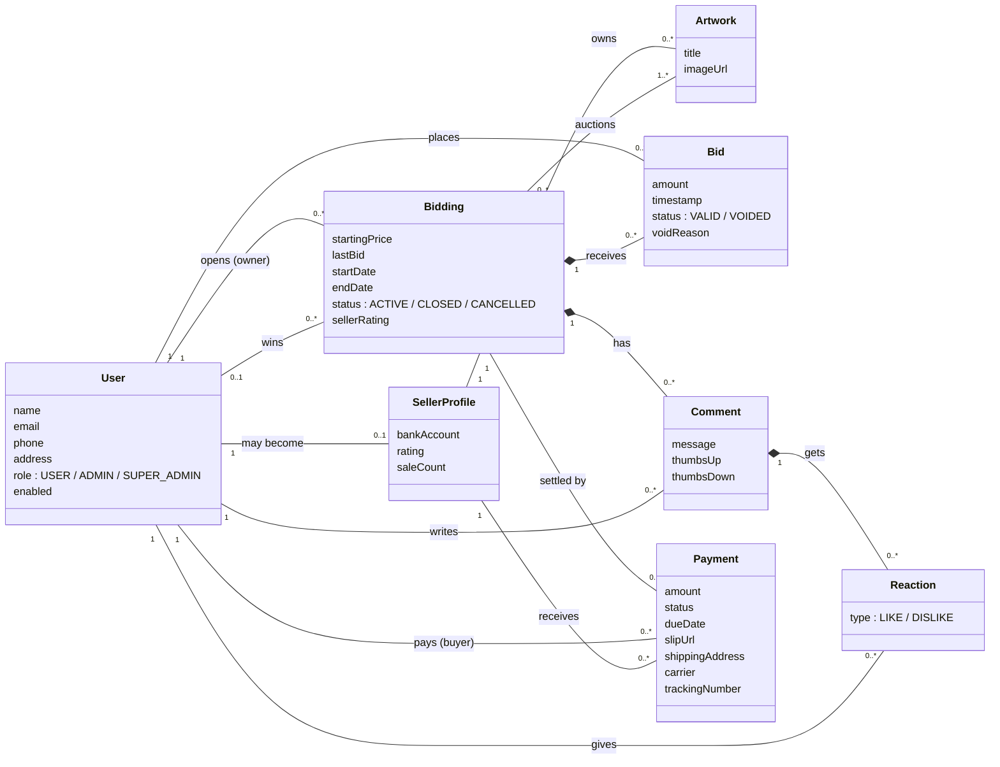

# 2. Domain Model / Conceptual Class Diagram

แสดงแนวคิดของธุรกิจ (ไม่ใส่ Service/Repository/DTO) โดยเน้นเฉพาะ attribute ที่สำคัญต่อโดเมน
ชื่อ class ตรงกับ Entity ใน `code/src/main/java/com/example/project/model/`

## อธิบายความสัมพันธ์สำคัญ

| ความสัมพันธ์ | ชนิด | ความหมาย / กฎธุรกิจ |
|---|---|---|
| User — SellerProfile | 1 : 0..1 (One-to-One) | User เป็นผู้ขายได้เมื่อสร้าง Seller Profile เท่านั้น |
| SellerProfile — Artwork | 1 : N | ผลงานเป็นของ Seller Profile หนึ่งเดียว |
| Bidding — Artwork | M : N | ประมูลหนึ่งครั้งมีหลายชิ้นได้ และผลงานเดิมประมูลซ้ำได้ (เช่น หลังยกเลิก) แต่ห้ามอยู่ในประมูล ACTIVE สองรายการพร้อมกัน |
| User — Bidding | 1 : N (owner) และ 0..1 : N (winner) | เจ้าของประมูลห้ามประมูลของตัวเอง; ผู้ชนะถูกกำหนดตอนปิดประมูล |
| Bidding — Bid | 1 : N (composition) | Bid ที่ถูก void ยังเก็บไว้เป็นประวัติ (`VOIDED`) ไม่ถูกลบ |
| Bidding — Comment — Reaction | 1 : N : N (composition) | ลบ Comment แล้ว Reaction ถูกลบตาม; 1 user มี 1 reaction ต่อ 1 comment |
| Bidding — Payment | 1 : 0..1 | มี Payment ได้เฉพาะประมูลที่ปิดแล้วและมีผู้ชนะ |
| Payment — User / SellerProfile | N : 1 | Buyer = ผู้ชนะ; ผู้ขายอ้างผ่าน Seller Profile เพื่อให้ Buyer เห็นเลขบัญชีล่าสุดเสมอ |

หมายเหตุ: ข้อมูลการจัดส่ง (carrier, tracking) เก็บอยู่ใน `Payment` เพราะการจัดส่งเกิดขึ้นเพียงครั้งเดียวต่อการชำระเงินหนึ่งรายการ
