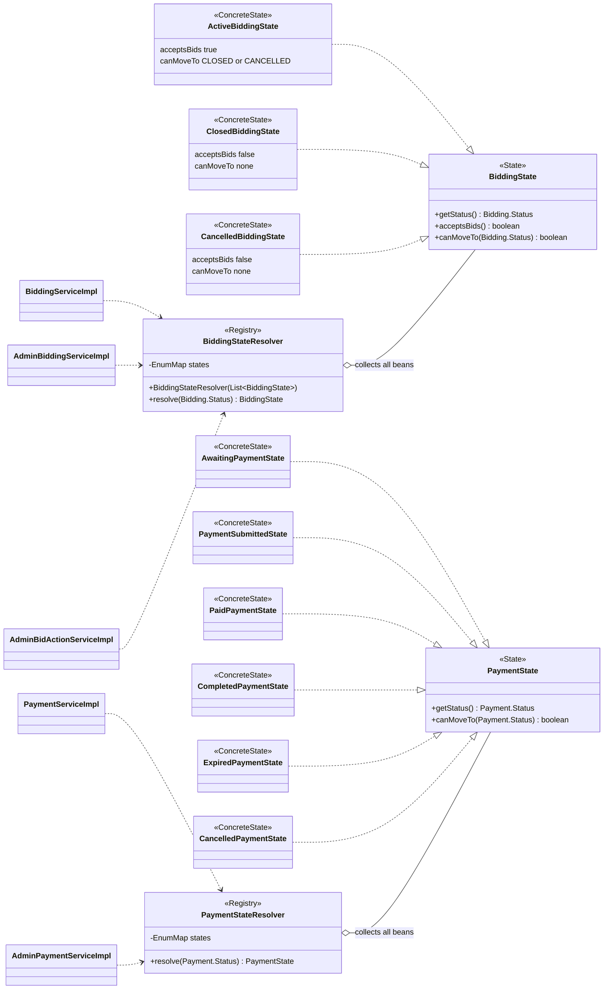
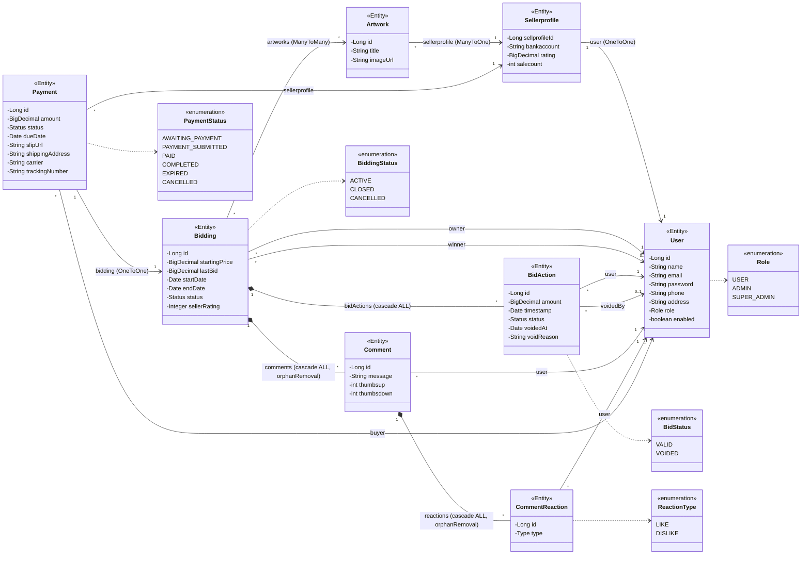
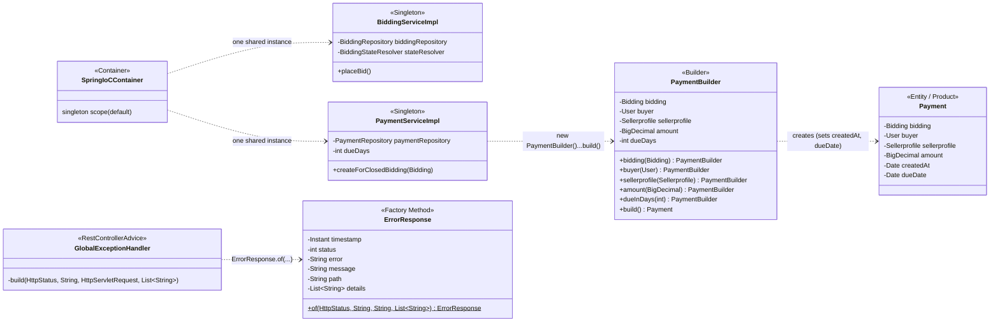

# 3. Class Diagram (พร้อมตำแหน่ง Design Pattern)

path ทุกไฟล์อยู่ใต้ `code/src/main/java/com/example/project/`
เพื่อให้อ่านได้ แยกเป็น 4 รูป: (A) ภาพรวมทุก Layer ของ flow ประมูล/ชำระเงิน, (B) State Pattern, (C) Entity และความสัมพันธ์, (D) GoF Creational Patterns (Singleton / Factory Method / Builder)

## 3.0 สัญลักษณ์ Pattern ที่ใช้ในแผนภาพ

| Stereotype | Pattern | ตำแหน่งในโค้ด |
|---|---|---|
| `<<Controller>>` | MVC (Controller) / Layered – Presentation | `controller/api/*`, `controller/PageController` |
| `<<Service>>` | Service Layer Pattern | `service/*Service` + `service/implementation/*Impl` |
| `<<Repository>>` | Repository Pattern (Spring Data JPA) | `repository/*` |
| `<<Entity>>` | Domain Model (Model ของ MVC) | `model/*` |
| `<<DTO>>` | DTO Pattern | `dto/request/*`, `dto/response/*` |
| `<<Mapper>>` | Mapper | `mapper/*` |
| `<<State>>` / `<<ConcreteState>>` | **State** (GoF – Behavioral) | `service/state/*` |
| `<<Registry>>` | ตัวเลือก State ตาม enum (Lookup ผ่าน `EnumMap`) | `*StateResolver` |
| `<<Builder>>` | **Builder** (GoF – Creational, เขียนเอง) | `model/PaymentBuilder` (ใช้โดย `PaymentServiceImpl.createForClosedBidding`) |
| `<<Factory Method>>` | **Factory Method** (GoF – Creational, static factory) | `exception/ErrorResponse.of(...)` (ใช้โดย `GlobalExceptionHandler`) |
| `<<Singleton>>` | **Singleton** (GoF – Creational, ผ่าน Spring IoC) | ทุก `@Service` / `@Component` / `@RestController` เช่น `BiddingServiceImpl` |

`*Service`, `*Repository`, `BiddingState`, `PaymentState` ในรูปเป็น **interface** (Mermaid ใส่ stereotype ได้ทีละอัน จึงแสดงเฉพาะชื่อ pattern); ส่วน `*ServiceImpl` และ `*StateResolver` เป็น class จริง

Dependency Injection (constructor injection) ใช้กับทุก class ในแผนภาพ — ลูกศร `..>` แสดงสิ่งที่ถูก inject
Singleton: ทุก `@Service` / `@Component` / `@RestController` เป็น Spring singleton bean (scope เริ่มต้น)

## 3.A ภาพรวม Layered Architecture (flow ประมูล → ชำระเงิน)

```mermaid
classDiagram
    direction TB

    %% ---------- Presentation ----------
    class BiddingController {
        <<Controller>>
        +createBidding()
        +getBiddings()
        +placeBid()
        +cancelBidding()
        +rateSeller()
    }
    class PaymentController {
        <<Controller>>
        +getPurchases()
        +getSales()
        +submitSlip()
        +confirmPayment()
        +rejectPayment()
        +ship()
    }
    class AdminBiddingController {
        <<Controller>>
        +cancelBidding()
        +closeBidding()
    }

    %% ---------- DTO / Mapper ----------
    class PlaceBidRequest {
        <<DTO>>
        amount
    }
    class BiddingResponse {
        <<DTO>>
    }
    class PaymentResponse {
        <<DTO>>
    }
    class BiddingMapper {
        <<Mapper>>
        +toResponse(Bidding)
        +toResponse(BidAction)
    }
    class PaymentMapper {
        <<Mapper>>
        +toResponse(Payment)
    }

    %% ---------- Service interfaces ----------
    class BiddingService {
        <<Service>>
        +createBidding()
        +placeBid()
        +cancelBidding()
    }
    class PaymentService {
        <<Service>>
        +createForClosedBidding()
        +submitSlip()
        +confirmPayment()
        +rejectPayment()
        +ship()
        +expireOverduePayments()
    }
    class BiddingClosingService {
        <<Service>>
        +close()
        +closeExpiredBiddings()
    }
    class AdminBiddingService {
        <<Service>>
        +cancelBidding()
        +closeBidding()
    }

    %% ---------- Service implementations ----------
    class BiddingServiceImpl {
        -MIN_BID_INCREMENT
        +placeBid()
    }
    class PaymentServiceImpl {
        +submitSlip()
        +ship()
    }
    class BiddingClosingServiceImpl
    class AdminBiddingServiceImpl

    %% ---------- Builder pattern (Creational) ----------
    class PaymentBuilder {
        <<Builder>>
        +bidding(Bidding) PaymentBuilder
        +buyer(User) PaymentBuilder
        +sellerprofile(Sellerprofile) PaymentBuilder
        +amount(BigDecimal) PaymentBuilder
        +dueInDays(int) PaymentBuilder
        +build() Payment
    }

    %% ---------- State pattern ----------
    class BiddingStateResolver {
        <<Registry>>
        +resolve(Status) BiddingState
    }
    class PaymentStateResolver {
        <<Registry>>
        +resolve(Status) PaymentState
    }
    class BiddingState {
        <<State>>
    }
    class PaymentState {
        <<State>>
    }

    %% ---------- Scheduler ----------
    class BiddingExpiryScheduler {
        <<Scheduler>>
    }
    class PaymentExpiryScheduler {
        <<Scheduler>>
    }

    %% ---------- Repository ----------
    class BiddingRepository {
        <<Repository>>
        +findByIdForUpdate()
    }
    class BidActionRepository {
        <<Repository>>
    }
    class PaymentRepository {
        <<Repository>>
    }
    class SellerprofileRepository {
        <<Repository>>
    }

    %% ---------- Domain ----------
    class Bidding {
        <<Entity>>
    }
    class BidAction {
        <<Entity>>
    }
    class Payment {
        <<Entity>>
    }
    class Sellerprofile {
        <<Entity>>
    }

    %% Controller -> Service / Mapper / DTO
    BiddingController ..> BiddingService
    BiddingController ..> BiddingMapper
    BiddingController ..> PlaceBidRequest
    PaymentController ..> PaymentService
    PaymentController ..> PaymentMapper
    AdminBiddingController ..> AdminBiddingService
    BiddingMapper ..> BiddingResponse
    PaymentMapper ..> PaymentResponse

    %% Service impl realises interface (DIP)
    BiddingServiceImpl ..|> BiddingService
    PaymentServiceImpl ..|> PaymentService
    BiddingClosingServiceImpl ..|> BiddingClosingService
    AdminBiddingServiceImpl ..|> AdminBiddingService

    %% Service -> others
    BiddingServiceImpl ..> BiddingStateResolver
    BiddingServiceImpl ..> BiddingRepository
    BiddingServiceImpl ..> BidActionRepository
    PaymentServiceImpl ..> PaymentStateResolver
    PaymentServiceImpl ..> PaymentRepository
    PaymentServiceImpl ..> SellerprofileRepository
    PaymentServiceImpl ..> PaymentBuilder : creates Payment via
    PaymentBuilder ..> Payment : builds
    BiddingClosingServiceImpl ..> PaymentService
    BiddingClosingServiceImpl ..> BiddingRepository
    BiddingClosingServiceImpl ..> BidActionRepository
    AdminBiddingServiceImpl ..> BiddingClosingService
    AdminBiddingServiceImpl ..> BiddingStateResolver

    %% Schedulers
    BiddingExpiryScheduler ..> BiddingClosingService
    PaymentExpiryScheduler ..> PaymentService

    %% State
    BiddingStateResolver o-- BiddingState
    PaymentStateResolver o-- PaymentState

    %% Repository -> Entity
    BiddingRepository ..> Bidding
    BidActionRepository ..> BidAction
    PaymentRepository ..> Payment
    SellerprofileRepository ..> Sellerprofile
```

**จุดที่ใช้ Pattern ในรูป A**

| Pattern | ตำแหน่ง | เหตุผล |
|---|---|---|
| Layered Architecture | Controller → Service → Repository → Entity (ลูกศรทุกเส้นไปทางเดียว ไม่ข้าม Layer) | แยกความรับผิดชอบ, ทดสอบทีละชั้นได้ |
| Service Layer | `*Service` / `*ServiceImpl` | รวม business rule และ `@Transactional` ไว้ที่เดียว (เช่น กฎ bid ขั้นต่ำใน `BiddingServiceImpl.placeBid`) |
| DTO + Mapper | `PlaceBidRequest`, `BiddingResponse`, `BiddingMapper` | ไม่ส่ง Entity ออก API |
| Dependency Injection / DIP | `BiddingController ..> BiddingService` (interface) | Controller รู้จักแค่ interface; ใช้ constructor injection |
| State (GoF Behavioral) | `BiddingState`, `PaymentState` + `*StateResolver` | ดูรูป B |
| Builder (GoF Creational) | `PaymentBuilder` ← `PaymentServiceImpl.createForClosedBidding` | รวมการประกอบ `Payment` (bidding, buyer, seller, amount) และคำนวณ `createdAt`/`dueDate` ไว้ที่เดียว ตรวจความครบถ้วนใน `build()` — ดูรูป D |

## 3.B State Pattern (Bidding และ Payment)

**เหตุผลที่ใช้ State:** กฎ "สถานะไหนไปสถานะไหนได้" ของ Bidding (3 สถานะ) และ Payment (6 สถานะ) ไม่ต้องกระจายเป็น `if/switch` ใน Service — แต่ละสถานะรู้กฎของตัวเอง Service ถามผ่าน `resolver.resolve(status).canMoveTo(target)` และเพิ่มสถานะใหม่ได้ด้วยการเพิ่ม class (OCP)

หมายเหตุ: การนำ State มาใช้แบบนี้เป็นรูปแบบ "state เป็นพฤติกรรมตรวจกฎการย้าย" โดย Entity ยังเก็บสถานะเป็น enum (เพื่อ persist ด้วย JPA) และ Service เป็นผู้สั่งเปลี่ยนสถานะ

## 3.C Entity และความสัมพันธ์ (Domain Layer)

ในโค้ดจริง enum เหล่านี้เป็น nested enum (`User.Role`, `Bidding.Status`, `BidAction.Status`, `Payment.Status`, `CommentReaction.Type`) — รูปนี้แยกเป็นกล่องเพื่อให้อ่านง่าย

## 3.D GoF Creational Patterns (Singleton, Factory Method, Builder)

| Pattern | Role ในรูป | ปัญหาที่แก้ |
|---|---|---|
| Singleton | `BiddingServiceImpl`, `PaymentServiceImpl` (และทุก `@Service`/`@Component`) | มี instance เดียวต่อ Spring context ไม่ต้องเขียน `getInstance()` เอง และ inject ผ่าน constructor ได้ |
| Factory Method | `ErrorResponse.of(...)` | จัดรูปแบบ error body (timestamp, status, reason phrase) ที่จุดเดียว `GlobalExceptionHandler` ไม่ต้องเรียก constructor 6 พารามิเตอร์เอง |
| Builder | `PaymentBuilder` → `Payment` | `Payment` ต้องมีหลายค่าและคำนวณ `createdAt`/`dueDate`; Builder ทำให้อ่านง่ายและโยน `IllegalStateException` ถ้าลืมตั้งค่าที่จำเป็น (`bidding`, `buyer`, `sellerprofile`, `amount`) |

หมายเหตุ: `PaymentBuilder` เป็น Builder ที่เขียนเอง (ไม่ใช้ Lombok `@Builder`) และ `status` เริ่มต้นเป็น `AWAITING_PAYMENT` จากค่า default ของ `Payment`
