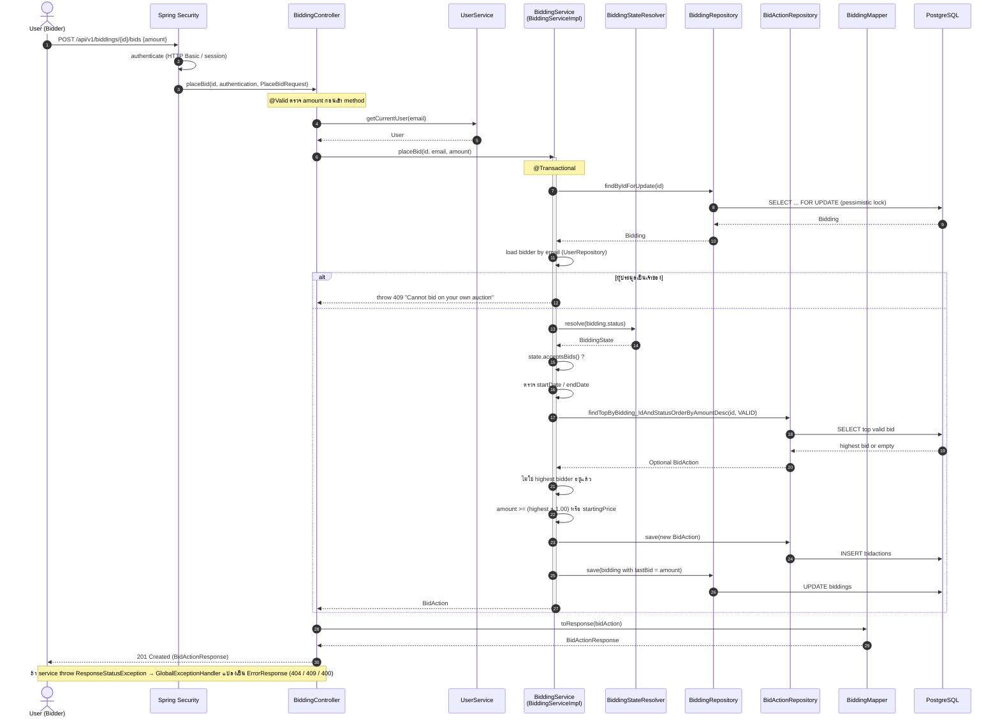
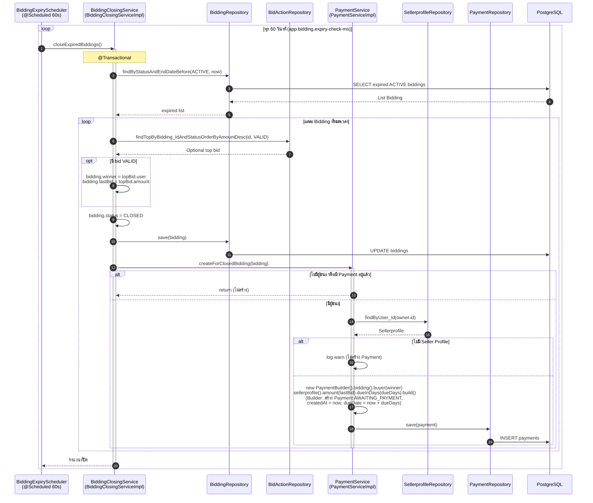
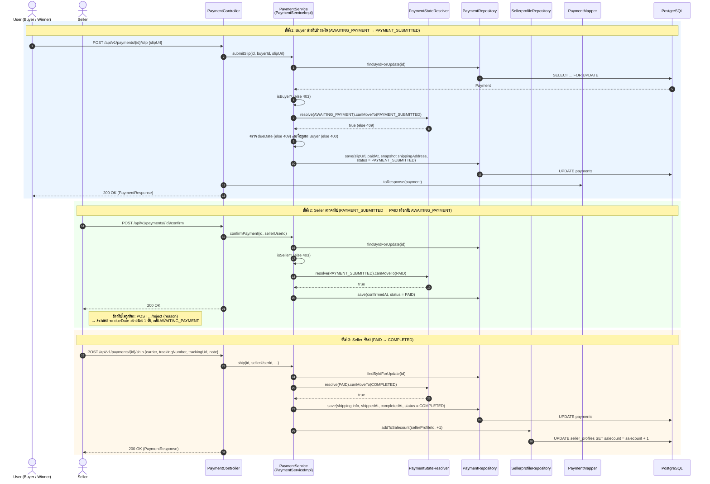
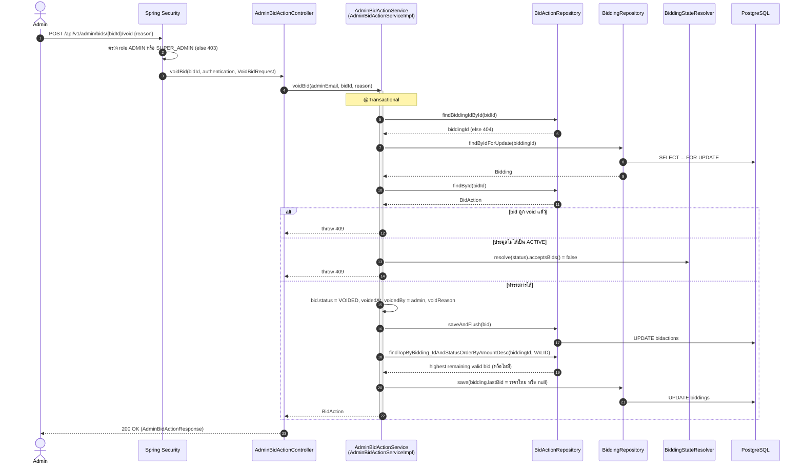

# 4. Sequence Diagrams

path ทุกไฟล์อยู่ใต้ `code/src/main/java/com/example/project/` — ลำดับการเรียกตรงกับโค้ดจริง และเป็นไปตามกฎ Layered Architecture (Controller ไม่เรียก Repository ตรง ๆ)

| # | Scenario | โค้ดหลัก |
|---|---|---|
| 4.1 | ผู้ใช้ลงราคาประมูล (Place Bid) | `BiddingController.placeBid`, `BiddingServiceImpl.placeBid` |
| 4.2 | ระบบปิดประมูลอัตโนมัติและสร้างรายการชำระเงิน | `BiddingExpiryScheduler`, `BiddingClosingServiceImpl`, `PaymentServiceImpl.createForClosedBidding`, `PaymentBuilder` |
| 4.3 | ชำระเงินและจัดส่ง (ส่งสลิป → ยืนยัน → จัดส่ง) | `PaymentController`, `PaymentServiceImpl` |
| 4.4 | Admin ยกเลิก (Void) bid | `AdminBidActionController`, `AdminBidActionServiceImpl.voidBid` |

---

## 4.1 Place Bid

**Pattern ที่เห็นใน scenario นี้:** Layered + Service Layer (กฎ bid อยู่ใน Service), DTO/Mapper (`PlaceBidRequest` → `BidActionResponse`), State (`BiddingStateResolver.resolve(...).acceptsBids()`), Repository (Spring Data JPA), Dependency Injection

---

## 4.2 ระบบปิดประมูลอัตโนมัติและสร้างรายการชำระเงิน

**Pattern:** Scheduler เรียก Service ผ่าน interface (DIP), Service Layer ประสานหลาย Repository ใน transaction เดียว, State (Bidding `ACTIVE` → `CLOSED`)
**หมายเหตุ:** `BiddingClosingService.close` ถูกใช้ซ้ำโดย `AdminBiddingServiceImpl.closeBidding` (Admin ปิดประมูลก่อนเวลา) จึงมี flow เดียวกัน

---

## 4.3 ชำระเงินและจัดส่ง (Buyer ส่งสลิป → Seller ยืนยัน → Seller จัดส่ง)

**Pattern:** State (`PaymentStateResolver` ตรวจทุกการเปลี่ยนสถานะ), Service Layer + `@Transactional`, Pessimistic Locking กัน race condition, DTO/Mapper
**Error ทั่วไป:** `403` ไม่ใช่เจ้าของ payment, `409` ย้ายสถานะไม่ได้/เลยกำหนด, `404` ไม่พบ

---

## 4.4 Admin ยกเลิก (Void) bid

**Pattern:** State (ยอม void ได้เฉพาะตอน `acceptsBids()`), Service Layer, Mapper/DTO — Admin API แยก Controller/Service ตาม ISP
