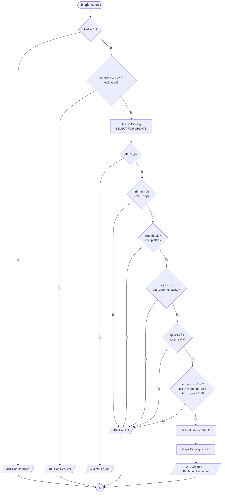
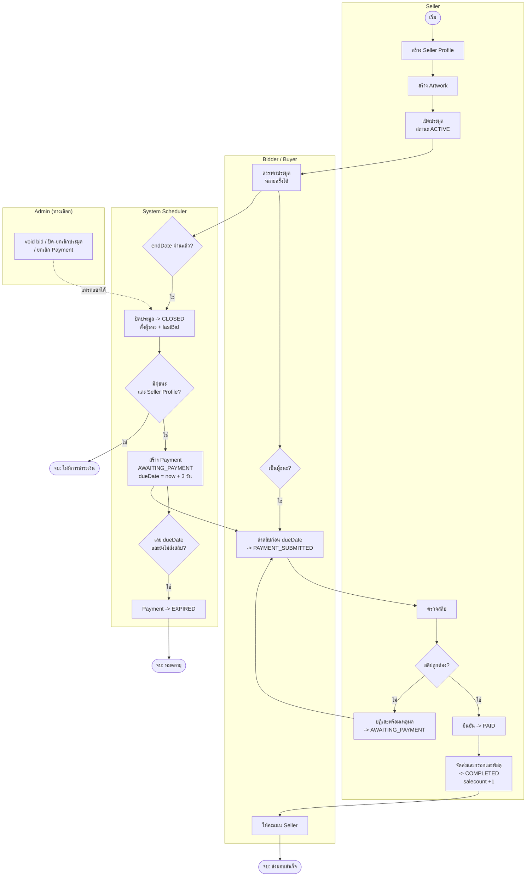

# 5. Activity Diagram

Mermaid ไม่มี Activity Diagram โดยตรง จึงใช้ flowchart: วงรี = จุดเริ่ม/จบ, สี่เหลี่ยม = กิจกรรม, ข้าวหลามตัด = เงื่อนไข (decision), กรอบ = swimlane

## 5.1 กระบวนการลงราคาประมูล (Place Bid)

## 5.2 วงจรชีวิตของการประมูลจนส่งมอบสินค้า (Swimlane)

หมายเหตุ: ค่า `dueDate` เริ่มต้น 3 วัน มาจาก `app.payment.due-days:3` ใน `PaymentServiceImpl`; Seller ยกเลิกประมูลเองได้เฉพาะตอนยังไม่มี bid (ไม่ได้แสดงในรูป — ดูหัวข้อ UC08 และ State Diagram)
