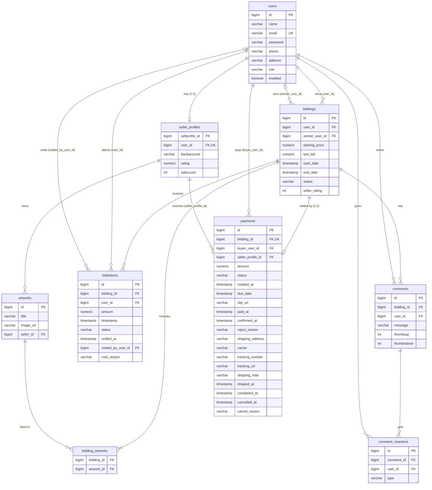

# 6. ER Diagram / Database Schema

สร้างจาก Entity ใน `code/src/main/java/com/example/project/model/` — ชื่อตาราง/คอลัมน์เป็น snake_case ตาม naming strategy เริ่มต้นของ Spring Boot + Hibernate (`spring.jpa.hibernate.ddl-auto=update`, PostgreSQL)

## 6.1 สรุปตารางและความสัมพันธ์ (เทียบกับข้อกำหนดข้อ 6)

| ข้อกำหนด | ในระบบ |
|---|---|
| ≥ 6 ตาราง | **9 ตาราง**: `users`, `seller_profiles`, `artworks`, `biddings`, `bidding_artworks`, `bidactions`, `comments`, `comment_reactions`, `payments` |
| One-to-One | `users` ↔ `seller_profiles` (`user_id` UNIQUE); `biddings` ↔ `payments` (`bidding_id` UNIQUE) |
| One-to-Many | `biddings` → `bidactions`, `biddings` → `comments`, `comments` → `comment_reactions`, `seller_profiles` → `artworks`, `users` → `biddings` ฯลฯ |
| Many-to-Many (คะแนนพิเศษ) | `biddings` ↔ `artworks` ผ่านตารางเชื่อม `bidding_artworks` |
| Foreign Key | ทุกคอลัมน์ `*_id` ที่ระบุ FK ในรูป (`@ManyToOne` / `@OneToOne` / `@JoinColumn`) |

## 6.2 รายละเอียดชนิดข้อมูลและ Constraint

| ตาราง.คอลัมน์ | ชนิด / Constraint |
|---|---|
| `users.email` | `varchar(255) NOT NULL UNIQUE` (เก็บเป็นตัวพิมพ์เล็ก) |
| `users.role` | `varchar` — enum string: `USER` / `ADMIN` / `SUPER_ADMIN` |
| `users.enabled` | `boolean NOT NULL DEFAULT true` |
| `seller_profiles.user_id` | `bigint NOT NULL UNIQUE` → `users.id` |
| `seller_profiles.rating` | `numeric(3,2)` |
| `artworks.image_url` | `varchar(2048)` |
| `biddings.status` | `varchar NOT NULL` — `ACTIVE` / `CLOSED` / `CANCELLED` |
| `biddings.starting_price`, `last_bid` | `numeric(19,4)` |
| `biddings.user_id` / `winner_user_id` | FK → `users.id` (เจ้าของ / ผู้ชนะ; ผู้ชนะ NULL ได้) |
| `bidactions.amount` | `numeric(19,4) NOT NULL` |
| `bidactions.status` | `varchar NOT NULL` — `VALID` / `VOIDED` |
| `bidactions.void_reason` | `varchar(500)` |
| `comments.message` | `varchar(2000) NOT NULL` |
| `comments.bidding_id` | `bigint NOT NULL` → `biddings.id` (`FetchType.LAZY`) |
| `comment_reactions` | `UNIQUE (comment_id, user_id)` — 1 reaction ต่อ user ต่อ comment; `type`: `LIKE` / `DISLIKE` |
| `payments.bidding_id` | `bigint NOT NULL UNIQUE` → `biddings.id` |
| `payments.status` | `varchar(30) NOT NULL` — 6 สถานะ (ดู State Diagram) |
| `payments.amount` | `numeric(19,4) NOT NULL` — ราคาสุดท้ายที่ copy จาก bid ที่ชนะ |
| `payments.shipping_address` | `varchar(1000)` — snapshot ที่อยู่ ณ ตอนชำระ |
| `payments.slip_url`, `tracking_url` | `varchar(2048)` |

## 6.3 Cascade / Fetch ที่กำหนดไว้ในโค้ด

| ความสัมพันธ์ | Cascade | Fetch | เหตุผล |
|---|---|---|---|
| `Bidding` → `Comment` (`@OneToMany`) | `ALL` + `orphanRemoval` | LAZY (ค่าเริ่มต้น) | ความเห็นเป็นส่วนหนึ่งของประมูล ถอดออกจาก collection แล้วลบจริง |
| `Bidding` → `BidAction` (`@OneToMany`) | `ALL` (ไม่มี orphanRemoval) | LAZY (ค่าเริ่มต้น) | bid ต้องเก็บเป็นประวัติ ไม่ลบเมื่อถอดออกจาก collection |
| `Comment` → `CommentReaction` (`@OneToMany`) | `ALL` + `orphanRemoval` | LAZY (ค่าเริ่มต้น) | reaction ถูกลบพร้อมความเห็น |
| `Bidding` ↔ `Artwork` (`@ManyToMany`) | ไม่มี | LAZY (ค่าเริ่มต้น) | ผลงานมีวงจรชีวิตแยกจากประมูล ประมูลซ้ำได้ |
| `Comment` → `Bidding`, `CommentReaction` → `Comment` / `User` (`@ManyToOne`) | ไม่มี | `LAZY` (ระบุชัดเจน) | ลดการโหลดข้อมูลที่ไม่จำเป็น |
| `@ManyToOne` / `@OneToOne` อื่น ๆ (เช่น `Bidding.owner`, `Payment.bidding`) | ไม่มี | EAGER (ค่าเริ่มต้น JPA) | ยังไม่ได้กำหนดเอง — ถ้าต้องการลด query ให้พิจารณาเปลี่ยนเป็น `LAZY` |

## 6.4 Index

ในโค้ดปัจจุบันมีเฉพาะ index ที่เกิดจาก PRIMARY KEY และ UNIQUE constraint (`users.email`, `seller_profiles.user_id`, `payments.bidding_id`, `comment_reactions(comment_id,user_id)`) — **ยังไม่มี `@Index` ที่ประกาศเอง** ซึ่งข้อกำหนดข้อ 6 ต้องการ ข้อเสนอแนะ (ยังไม่ได้ทำในโค้ด):

| Index ที่แนะนำ | เหตุผล (query ที่ใช้จริง) |
|---|---|
| `biddings(status, end_date)` | scheduler ค้นประมูลที่ ACTIVE และหมดเวลาทุก 60 วินาที (`findByStatusAndEndDateBefore`) |
| `bidactions(bidding_id, status, amount)` | หา bid VALID สูงสุดของประมูล (`findTopBy...OrderByAmountDesc`) ทุกครั้งที่ลงราคา |
| `payments(status, due_date)` | scheduler ค้น payment ที่ AWAITING_PAYMENT และเลยกำหนด |
| `payments(buyer_user_id)`, `payments(seller_profile_id)` | หน้ารายการซื้อ/ขายของผู้ใช้ |
| `comments(bidding_id)` | ดึงความเห็นของประมูล (`findByBidding_IdOrderByIdAsc`) |
