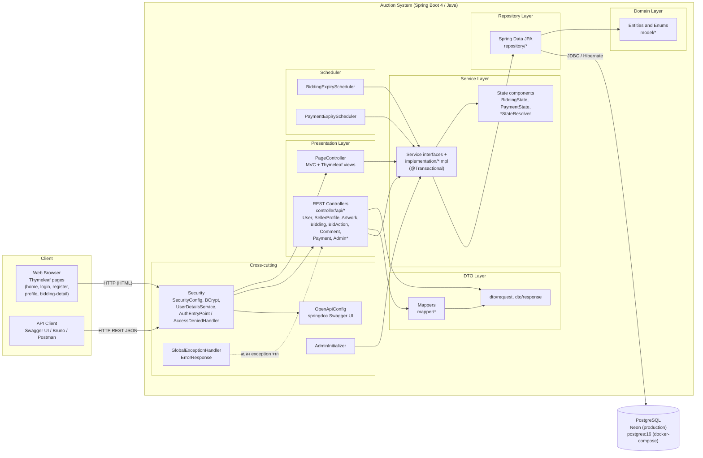
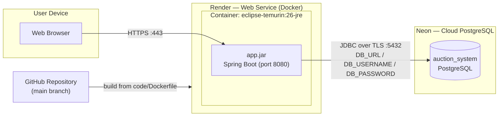
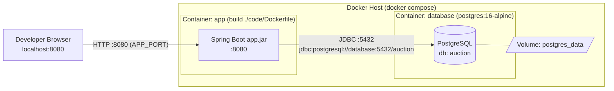

# 7. Component Diagram & Deployment Diagram

## 7.1 Component Diagram

แสดงองค์ประกอบภายใน Spring Boot application ตาม Layered Architecture และสิ่งที่เชื่อมต่อภายนอก (ลูกศรทึบ = เรียกใช้ / ขึ้นกับ)

**การตรวจกฎ Layered:** ไม่มีเส้น `Presentation → Repository` ตรง ๆ — Controller ทุกตัวต้องผ่าน Service (ตามข้อกำหนดข้อ 3)

| Component | หน้าที่ | ตำแหน่งหลัก |
|---|---|---|
| Security | ยืนยันตัวตน (form login + HTTP Basic + remember-me), กำหนดสิทธิ์ตาม role, ตอบ 401/403 เป็น JSON สำหรับ `/api/**` | `config/SecurityConfig` ฯลฯ |
| REST Controllers | รับ/ตอบ JSON ที่ `/api/v1/**`, ตรวจ `@Valid` | `controller/api/*` |
| PageController | คืนหน้า Thymeleaf | `controller/PageController` |
| Service Layer | กฎธุรกิจ + transaction | `service/*`, `service/implementation/*` |
| State components | กฎการเปลี่ยนสถานะ Bidding/Payment | `service/state/*` |
| Schedulers | ปิดประมูลและทำให้ payment หมดอายุทุก 60 วินาที | `scheduler/*` |
| Repository | เข้าถึงข้อมูลด้วย Spring Data JPA (มี pessimistic lock `findByIdForUpdate`) | `repository/*` |
| OpenAPI | Swagger UI ที่ `/swagger-ui.html` | `config/OpenApiConfig` |

## 7.2 Deployment Diagram

### (ก) Production — ตามที่ระบุใน README (Render Web Service + Neon PostgreSQL)

Environment variables ที่แอปต้องใช้ (จาก `application.properties`): `DB_URL`, `DB_USERNAME`, `DB_PASSWORD`, `REMEMBER_ME_KEY`, `PORT`, และ (ไม่บังคับ) `ADMIN_EMAIL`, `ADMIN_PASSWORD`

### (ข) Local / ทดสอบ — `docker-compose.yml`

| Node | รายละเอียด | ที่มา |
|---|---|---|
| `app` | build จาก `code/Dockerfile` — multi-stage: `eclipse-temurin:26-jdk` build ด้วย Maven Wrapper → `eclipse-temurin:26-jre` รัน `app.jar` | `code/Dockerfile` |
| `database` | `postgres:16-alpine`, healthcheck `pg_isready`, `app` รอจน healthy (`depends_on: service_healthy`) | `docker-compose.yml` |
| Volume | `postgres_data` เก็บข้อมูลถาวร | `docker-compose.yml` |

> ก่อนส่งงาน: ใส่ Deployment URL จริงใน README และตรวจว่าชื่อบริการ (Render / Neon) ตรงกับที่ deploy จริง — แผนภาพ (ก) เขียนตามหัวข้อ Tech Stack ใน README ปัจจุบัน
