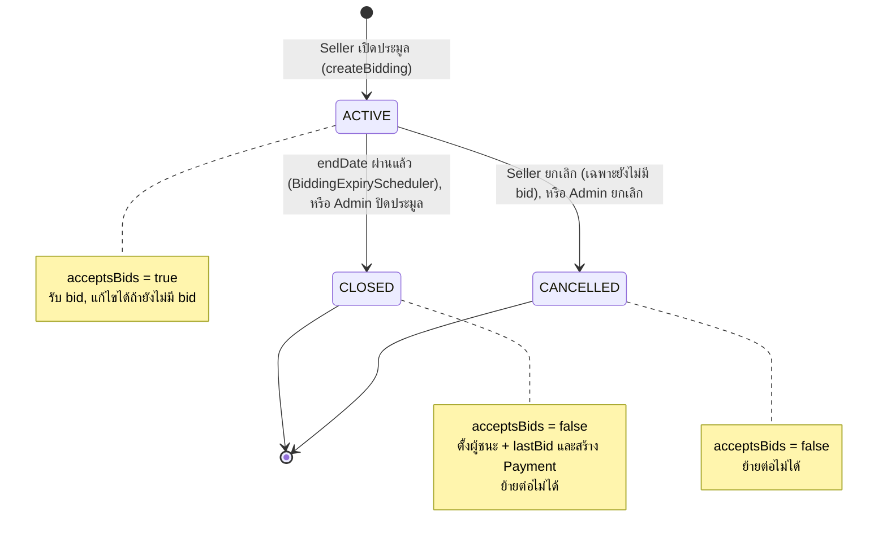
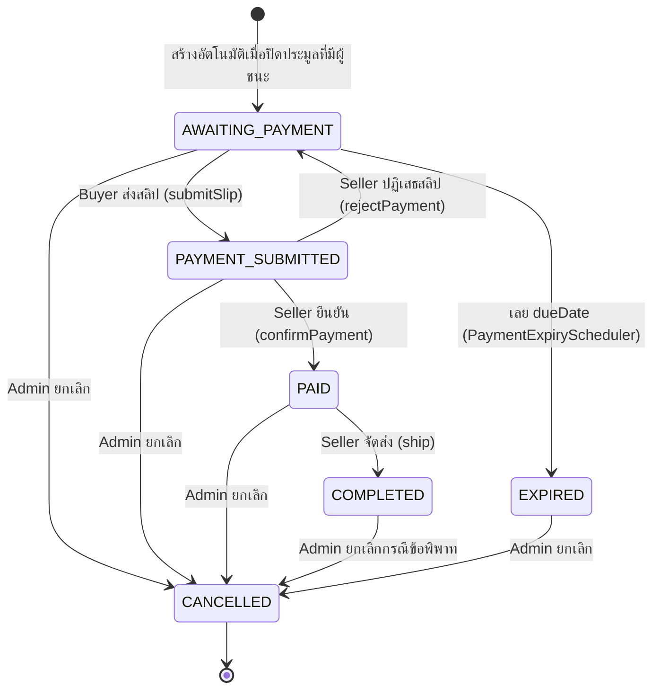
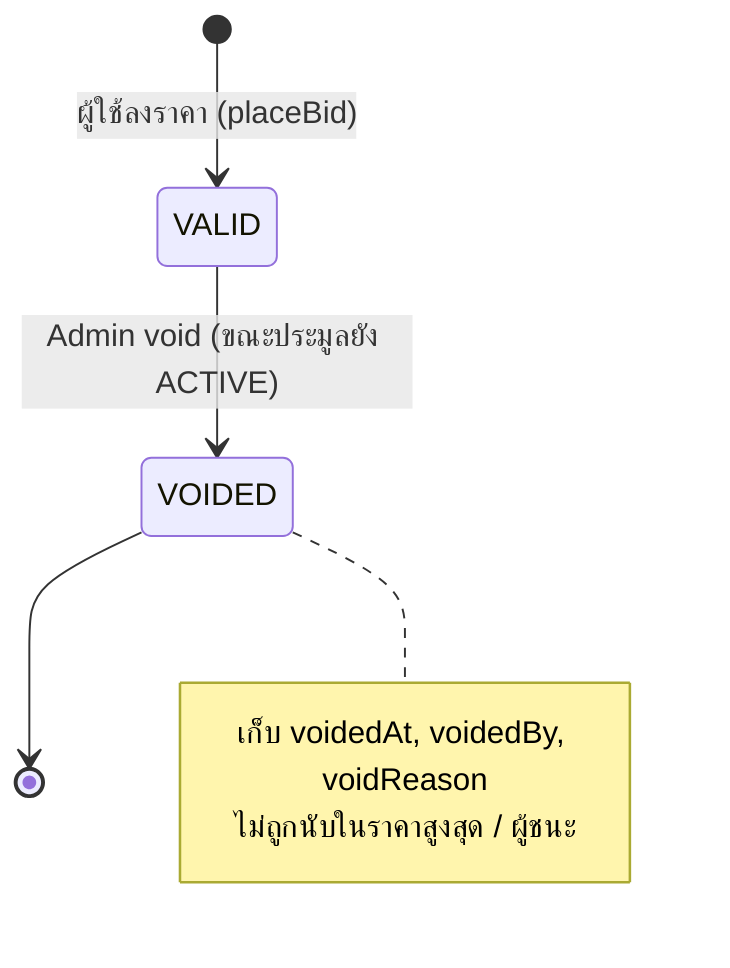

# 8. State Diagram

Entity ที่มีสถานะในระบบ: **Bidding**, **Payment**, **BidAction** — กฎการย้ายสถานะของสองตัวแรกถูกเขียนไว้ในคลาส `service/state/*` (State Pattern) ส่วน BidAction ควบคุมใน `AdminBidActionServiceImpl`

## 8.1 Bidding (`Bidding.Status`)

| จาก → ไป | เงื่อนไข / ผู้สั่ง | โค้ด |
|---|---|---|
| (เริ่ม) → ACTIVE | ค่าเริ่มต้นของ `Bidding.status` | `Bidding.java` |
| ACTIVE → CLOSED | scheduler ทุก 60 วินาที / `POST /api/v1/admin/biddings/{id}/close` | `BiddingClosingServiceImpl.close` |
| ACTIVE → CANCELLED | เจ้าของ (ไม่มี bid VALID) / Admin | `BiddingServiceImpl.cancelBidding`, `AdminBiddingServiceImpl.cancelBidding` |
| CLOSED, CANCELLED → อื่น | ไม่อนุญาต (`canMoveTo` คืน `false`) | `ClosedBiddingState`, `CancelledBiddingState` |

## 8.2 Payment (`Payment.Status`)

| สถานะ | ย้ายไปได้ (`canMoveTo`) | คลาส |
|---|---|---|
| AWAITING_PAYMENT | PAYMENT_SUBMITTED, EXPIRED, CANCELLED | `AwaitingPaymentState` |
| PAYMENT_SUBMITTED | PAID, AWAITING_PAYMENT, CANCELLED | `PaymentSubmittedState` |
| PAID | COMPLETED, CANCELLED | `PaidPaymentState` |
| COMPLETED | CANCELLED | `CompletedPaymentState` |
| EXPIRED | CANCELLED | `ExpiredPaymentState` |
| CANCELLED | — (สถานะสุดท้าย) | `CancelledPaymentState` |

ผลข้างเคียง: `COMPLETED` → `salecount` ของ Seller +1; ถ้ายกเลิกหลัง `COMPLETED` → `salecount` −1 และคะแนนที่ผู้ชนะให้ถูกถอน (`AdminPaymentServiceImpl.cancelPayment`)

## 8.3 BidAction (`BidAction.Status`)

