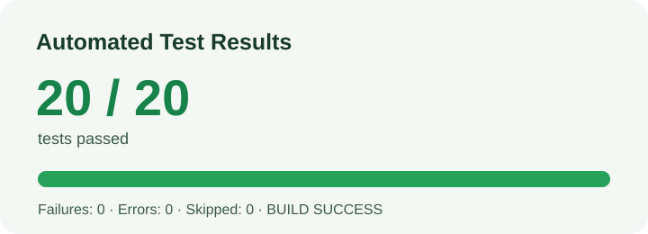

# Backend Test Report — 10 ตุลาคม 2026

## 1. ข้อมูลการทดสอบ

| รายการ | รายละเอียด |
|---|---|
| Project | Auction-System |
| Automated test command | `.\mvnw.cmd --batch-mode --no-transfer-progress verify` |
| Database | Isolated PostgreSQL 16 container (`auction_test`, localhost:5433) |
| Test frameworks | JUnit 5, Mockito, Spring Boot Test, MockMvc |
| Automated test result | 20 passed, 0 failed, 0 errors, 0 skipped |
| Build result | `BUILD SUCCESS`, exit code 0 |

Tests use generated test accounts and a disposable database. Do not point them at the production Neon database.

## 2. Test Cases and Results

### Application and user/authentication

| Test Case ID | Endpoint | Input / Action | Expected Result | Actual Result | Status |
|---|---|---|---|---|---|
| BE-001 | Spring Boot startup | Start app context and apply Flyway migrations | Application context starts | `ProjectApplicationTests.contextLoads` passed against PostgreSQL | Pass |
| BE-002 | `POST /api/v1/users` | Register with valid data | HTTP 201; account can be read back | HTTP 201; authenticated `GET /me` returned the registered user | Pass |
| BE-003 | `POST /api/v1/users` | Empty name, invalid email, short password | HTTP 400 with validation error | HTTP 400; response contained `Validation failed` | Pass |
| BE-004 | `POST /api/v1/users` | Register the same email twice | Second request returns HTTP 409 | Duplicate registration returned HTTP 409 | Pass |
| BE-005 | `GET /api/v1/users/me` | No authentication | HTTP 401 | HTTP 401 | Pass |
| BE-006 | `GET /api/v1/users/me` | Valid Basic authentication | HTTP 200 and current user details | HTTP 200; returned email matched the test account | Pass |
| BE-007 | `PUT /api/v1/users/me` | Update name, phone and address | HTTP 200 and updated profile | HTTP 200; updated name returned | Pass |
| BE-008 | `PUT /api/v1/users/me/password` | Change current password | HTTP 204; new password works, old password fails | HTTP 204; new credentials succeeded and old credentials returned HTTP 401 | Pass |
| BE-046 | `PUT /api/v1/users/me` | Authenticated request without CSRF token | HTTP 403; profile remains unchanged | HTTP 403; subsequent authenticated read showed the original name | Pass |
| BE-047 | `POST /register` | Create user from web registration form | Redirect to home and be authenticated in that session | Redirected to `/`; same session could access protected `/profile` | Pass |
| BE-038 | `GET /api/v1/admin/users` | Regular user requests admin user list | HTTP 403 | HTTP 403 | Pass |

### Seller and artwork

| Test Case ID | Endpoint | Input / Action | Expected Result | Actual Result | Status |
|---|---|---|---|---|---|
| BE-009 | `POST /api/v1/seller-profiles` | Authenticated user creates seller profile | HTTP 201 | HTTP 201 | Pass |
| BE-010 | `POST /api/v1/artworks` | Seller creates artwork | HTTP 201 and generated ID | HTTP 201; returned artwork ID | Pass |
| BE-011 | `POST /api/v1/artworks` | Unauthenticated request / blank title | HTTP 401 / HTTP 400 | HTTP 401 / HTTP 400 | Pass |
| BE-012 | `GET /api/v1/artworks?page=0&size=10&sort=id,desc` | Paginated and sorted listing | HTTP 200 with paged content | HTTP 200; content array included the created artwork | Pass |
| BE-013 | `GET /api/v1/artworks/{id}` | Read created artwork | HTTP 200 and matching ID | HTTP 200; ID matched | Pass |
| BE-014 | `PUT /api/v1/artworks/{id}` | Owner updates artwork | HTTP 200 with changed details | HTTP 200; updated title returned | Pass |
| BE-015 | `PUT /api/v1/artworks/{id}` | Different user attempts update | HTTP 403 | HTTP 403 | Pass |
| BE-016 | `DELETE /api/v1/artworks/{id}` | Owner deletes artwork without bidding history | HTTP 204; subsequent read returns 404 | HTTP 204; subsequent read returned HTTP 404 | Pass |

### Seller profile

| Test Case ID | Endpoint | Input / Action | Expected Result | Actual Result | Status |
|---|---|---|---|---|---|
| BE-039 | `GET /api/v1/seller-profiles/me` | Seller reads private profile | HTTP 200 and bank account is visible to owner | HTTP 200; expected bank account returned | Pass |
| BE-040 | `PUT /api/v1/seller-profiles/me` | Seller updates bank account | HTTP 200 and changed account returned | HTTP 200; updated value returned | Pass |
| BE-041 | `GET /api/v1/seller-profiles/users/{userId}` | Public profile lookup | HTTP 200 without bank account | HTTP 200; user ID returned and bank account omitted | Pass |
| BE-042 | `GET /api/v1/seller-profiles/me` | Unauthenticated request | HTTP 401 | HTTP 401 | Pass |

### Bidding, bids and comments

| Test Case ID | Endpoint | Input / Action | Expected Result | Actual Result | Status |
|---|---|---|---|---|---|
| BE-017 | `POST /api/v1/biddings` | Seller creates bidding for owned artwork | HTTP 201 | HTTP 201; bidding was readable afterward | Pass |
| BE-018 | `GET /api/v1/biddings?page=0&size=5&sort=id,asc` | Paginated listing | HTTP 200 with paged content | HTTP 200; content array returned | Pass |
| BE-019 | `GET /api/v1/biddings/{id}` | Read created bidding | HTTP 200 and `ACTIVE` status | HTTP 200; status was `ACTIVE` | Pass |
| BE-020 | `POST /api/v1/biddings/{id}/bids` | No authentication | HTTP 401 | HTTP 401 | Pass |
| BE-021 | `POST /api/v1/biddings/{id}/bids` | Auction owner bids on own auction | HTTP 409 | HTTP 409 | Pass |
| BE-022 | `POST /api/v1/biddings/{id}/bids` | First bid at starting price 100.00 | HTTP 201 | HTTP 201; amount was 100.00 | Pass |
| BE-023 | `POST /api/v1/biddings/{id}/bids` | Next bid at minimum increment 102.50 | HTTP 201 | HTTP 201; amount was 102.50 | Pass |
| BE-024 | `POST /api/v1/biddings/{id}/bids` | Bid below required increment | HTTP 409 | HTTP 409 | Pass |
| BE-025 | `GET /api/v1/biddings/{id}/bids/highest` | Read highest bid | HTTP 200; amount is 102.50 | HTTP 200; amount was 102.50 | Pass |
| BE-026 | `PUT /api/v1/biddings/{id}` | Owner edits bidding after bids exist | HTTP 409 | HTTP 409 | Pass |
| BE-027 | `POST /api/v1/biddings/{id}/comments` | Save SQL-injection-shaped text (`' OR '1'='1 --`) as comment | HTTP 201; text is stored as data | HTTP 201; response preserved the exact text | Pass |
| BE-028 | `POST /api/v1/biddings/{id}/comments/{commentId}/like` | Different user likes comment | HTTP 200; thumbs-up count is 1 | HTTP 200; thumbs-up count was 1 | Pass |
| BE-029 | `PUT /api/v1/biddings/{id}/comments/{commentId}` | Comment author updates message | HTTP 200 and changed message | HTTP 200; updated message was readable | Pass |
| BE-030 | `DELETE /api/v1/biddings/{id}/comments/{commentId}` | Comment author deletes comment | HTTP 204; list empty afterward | HTTP 204; subsequent list was empty | Pass |
| BE-043 | `POST /api/v1/biddings/{id}/comments/{commentId}/dislike` | Different user dislikes comment | HTTP 200; thumbs-down count is 1 | HTTP 200; thumbs-down count was 1 | Pass |
| BE-044 | `GET /api/v1/users/me/bids`, `/api/v1/biddings/mine`, `/api/v1/biddings/won` | Read bidder/owner lists | HTTP 200 and expected page/list shapes | All returned HTTP 200; bidder and owner records verified | Pass |

### Admin APIs (test-only admin fixtures)

| Test Case ID | Endpoint / Action | Input / Action | Expected Result | Actual Result | Status |
|---|---|---|---|---|---|
| BE-048 | `GET /api/v1/admin/users`, `POST /admin/users/{id}/promote`, and user status | `SUPER_ADMIN` lists users, promotes a regular user, then disables the resulting admin; regular `ADMIN` cannot promote | Promotion action visible only to `SUPER_ADMIN`; successful promotion changes role to `ADMIN`; regular admin receives HTTP 403; disabled account cannot authenticate | Super admin promoted the test user and changed its status; regular admin saw no promotion action and POST was denied; disabled account authentication returned HTTP 401 | Pass |
| BE-049 | Admin bidding and payment routes | `SUPER_ADMIN` cancels an auction, closes another with a winning bid, lists/cancels its payment, and opens the web payments screen; `ADMIN` also lists payments | HTTP 200; status/payment transitions persist with cancellation reason; both roles can use payment management | Auction cancel/close succeeded; closing created an `AWAITING_PAYMENT`; both roles listed the payment; `SUPER_ADMIN` canceled it and opened the web screen | Pass |

### Additional service-level bidding rules

| Test Case ID | Scenario | Expected Result | Actual Result | Status |
|---|---|---|---|---|
| BE-031 | Accept a bid at seller-configured increment | Bid accepted and last bid updated | Passed with amount 102.50 | Pass |
| BE-032 | Bid below seller-configured increment | HTTP 409; bid is not saved | HTTP 409; repository save was not called | Pass |
| BE-033 | First bid equals starting price | Bid accepted and last bid updated | Passed with amount 50.00 | Pass |
| BE-034 | Auction owner tries to bid | HTTP 409; bid is not saved | HTTP 409; repository save was not called | Pass |
| BE-035 | Bidding state does not accept bids | HTTP 409; bid is not saved | HTTP 409; repository save was not called | Pass |

### Browser/deployment smoke checks

| Test Case ID | Endpoint | Action | Expected Result | Actual Result | Status |
|---|---|---|---|---|---|
| BE-036 | `https://auction-system-68vk.onrender.com/` | Open home page in browser | Auction page renders | “Live auctions” page and listing rendered after Render cold start | Pass |
| BE-037 | `https://auction-system-68vk.onrender.com/swagger-ui/index.html` | Open Swagger UI in browser | Swagger UI renders | Swagger UI page loaded | Pass |
| BE-045 | Local Thymeleaf browser flow | Register, log in, update profile, then log out | Each page/action completes and updated name is shown | Playwright browser flow passed; logout returned to `/login?logout` | Pass |

The local flow was interactively executed with Playwright; it is not a committed, repeatable Playwright test suite.

## 3. Test Result Summary

| Test group | Tests | Passed | Failed | Skipped |
|---|---:|---:|---:|---:|
| User/authentication and authorization integration | 4 | 4 | 0 | 0 |
| Artwork integration | 2 | 2 | 0 | 0 |
| Seller-profile integration | 1 | 1 | 0 | 0 |
| Bidding/comment integration | 2 | 2 | 0 | 0 |
| Admin API integration | 3 | 3 | 0 | 0 |
| Thymeleaf page integration | 2 | 2 | 0 | 0 |
| Spring Boot application context | 1 | 1 | 0 | 0 |
| Bidding service unit tests | 5 | 5 | 0 | 0 |
| **Automated total (`mvn verify`)** | **20** | **20** | **0** | **0** |
| Browser smoke checks (home and Swagger) | 2 | 2 | 0 | 0 |
| Local Playwright browser flow (register, login, profile update, logout) | 1 | 1 | 0 | 0 |



See [TESTING-GUIDE.md](./TESTING-GUIDE.md) for reproducible commands, pass/fail criteria, manual test steps, and the remaining coverage checklist.

## 4. Test Execution

The full verification was run on 10 October 2026 against a fresh, disposable PostgreSQL 16 container using the `auction_test` database on port 5433. The project's existing PostgreSQL data volume was not used.

```powershell
Set-Location .\code
$env:DB_URL="jdbc:postgresql://localhost:5433/auction_test"
$env:DB_USERNAME="auction_test"
$env:DB_PASSWORD="auction_test_local_only"
$env:REMEMBER_ME_KEY="ci-only-remember-me-key"
.\mvnw.cmd --batch-mode --no-transfer-progress verify
```

Final result after CSRF remediation, auto-login, admin permission updates, and promotion UI: `Tests run: 20, Failures: 0, Errors: 0, Skipped: 0`; `BUILD SUCCESS`, exit code 0.

Detailed Surefire XML/text results are under `code/target/surefire-reports/`.

The local browser flows used Playwright 1.64.0 with Chromium and the same disposable PostgreSQL database. After CSRF protection was enabled, registration/login/profile-update/logout passed. Following the auto-login change, a fresh sign-up redirected directly to `/` and displayed authenticated navigation, including Profile and Log out, without a separate login. These were executed interactively through the browser and are not yet committed Playwright specs. The browser console also logged a DNS failure for the deliberately fake `example.test` image URL used by an API fixture; it did not block page rendering or the user journey.

## 5. Security Review and Coverage Limits

A read-only source review inspected API and web authentication/authorization, state-changing controller paths, request validation, JPA repositories/query construction, relevant templates, and application/deployment configuration.

- **SQL injection:** No SQL injection vulnerability was identified. Repository operations use derived JPA methods or bound JPQL parameters; no raw input-built SQL was found. The test also confirmed an injection-shaped comment is returned as literal data. This is not a substitute for a dedicated penetration test or exhaustive proof.
- **CSRF finding remediated:** `SecurityConfig` now keeps Spring Security's CSRF protection enabled for API routes as well as browser routes. A regression test verifies an authenticated state-changing API request without a CSRF token receives HTTP 403 and does not update the profile. A local browser registration/login/profile-update/logout flow also passed with CSRF enabled. API clients must retain their session cookie and send the CSRF token (for example, fetch `/register`, read the hidden `_csrf` value, then send it as `X-CSRF-TOKEN`) on state-changing requests.

The tested scope is materially broader but still does not cover every endpoint/service/page. Admin integration tests provision unique test-only accounts in the disposable PostgreSQL database, not production accounts. They cover user listing/disabling, `SUPER_ADMIN` promotion (and denial for regular `ADMIN`), auction cancel/close, and payment list/cancel by both admin roles. Remaining coverage includes:

- Buyer payment submission, seller confirmation/rejection/shipping, admin payment detail/filter, user re-enabling, and additional authorization transitions
- Admin moderation and bid-voiding success paths
- Seller rating and remaining rating/permission edge cases
- Bidding cancellation/closing, time-window boundaries, and other invalid date scenarios
- Remaining API error/ownership/validation branches and dedicated unit tests for services beyond bidding
- Most authenticated Thymeleaf pages and browser workflows, including auctions, bids, comments, seller settings, purchases/sales, and admin screens
- Automated, repeatable Playwright spec in the repository
- JaCoCo line/branch coverage (not configured or measured)

## 6. Defect Log

No failures were found in the 20 automated tests or the three browser checks. Untested areas above are coverage gaps, not confirmed defects. The CSRF issue found during source review was remediated and regression-tested; this is not a full penetration test or security certification.

## 7. Conclusion

The full automated Maven suite passes: 20 tests, 0 failures. MockMvc integration tests exercise registration/authentication including web sign-up auto-login, CSRF enforcement, user and seller profile updates, artwork CRUD/access control, bidding and comment workflows, a SQL-injection-shaped comment input, admin user listing/disabling/promotion, auction cancellation/closing, payment listing/cancellation by both admin roles, and selected rendered Thymeleaf pages against PostgreSQL. Manual browser checks verified the local registration/login/profile-update/logout flow with CSRF enabled; the deployed home page and Swagger UI also rendered. Buyer/seller payment transitions, other UI journeys, automated Playwright spec persistence, and code coverage measurement remain outstanding. No SQL injection was identified in the reviewed code; the CSRF configuration finding was fixed and verified.
